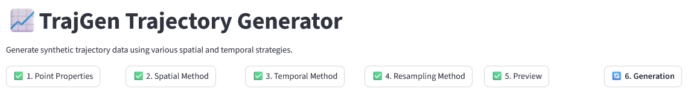
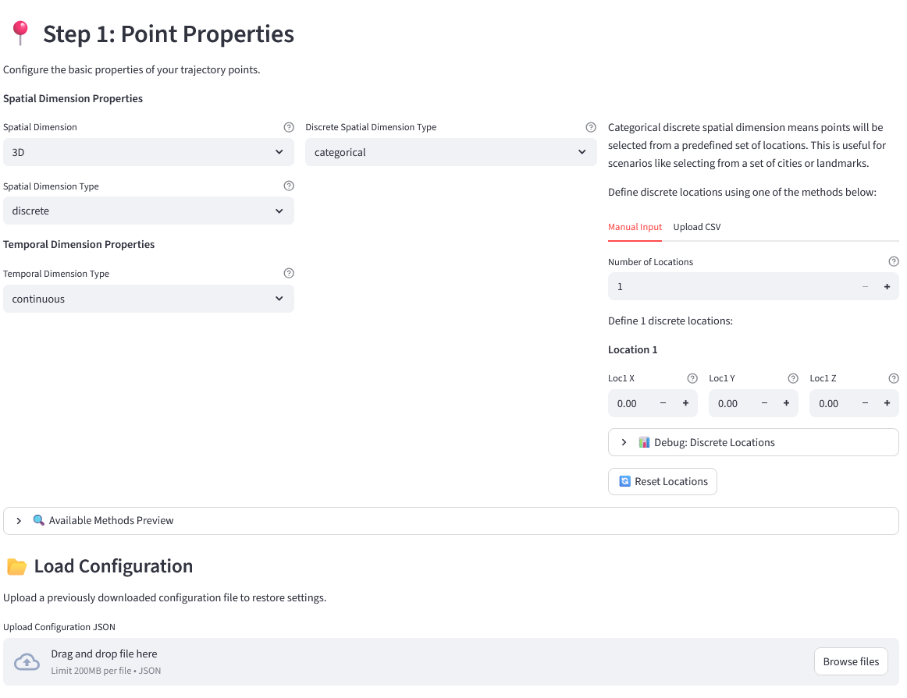
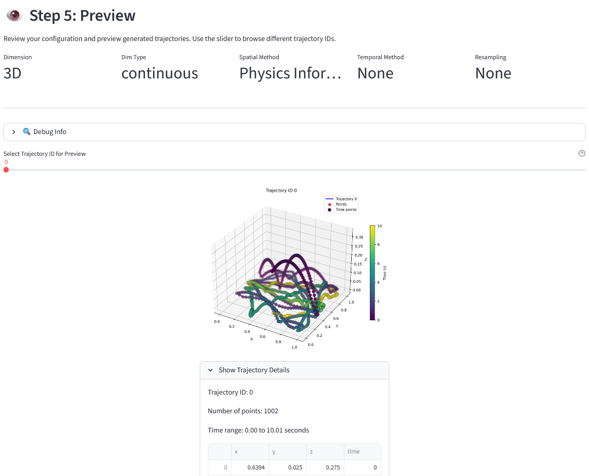
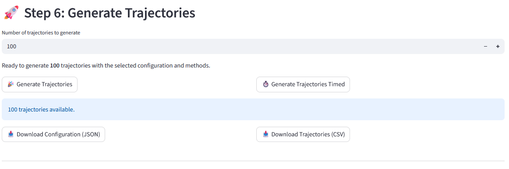

# TrajGen
This is a repository that holds different trajectory generation algorithms, which are meant to be used for research and development of spatial-temporal data services. 

The repository features an easy-to-use frontend for configuring trajectory generation. 


# Install and Check Installation
## Requirements and Dependencies
The project is organized as a Python project managed with the [uv package manager](https://docs.astral.sh/uv/getting-started/installation/). 
It requires at least Python 3.10 and the dependencies listed in `pyproject.toml`.


## Installation and Test
The repository is made to work with the uv package manager. 
```bash
uv init
uv pip install . 
uv run pytest
```

## Run Frontend For Trajectory Generation
```bash
uv run streamlit run src/app/app.py
```


# Strategies
The repository implements different trajectory generation strategies. These are structured in strategies for 

- spatial trajectory generation
- temporal trajectory generation
- resampling

These are available either for

- different spatial dimensions (2D and 3D)
- continuous and discrete spatial and temporal values. 

If only the backend should be used, the necessary parameters have to be set in a `Config` class as defined in [./src/trajgen/config.py]()

# Frontend
The frontend guides the user through a six-step process to generate the trajectory dataset:

1. Point Properties
2. Spatial Method
3. Temporal Method
4. Resampling Method
5. Preview
6. Generation



In steps 1. to 4. the user is guided through a method and parameter selection
An example of the input window for the point properties is given below:

Alternatively to clicking through the graphical user interface, you can also upload a JSON-style configuration file. 

After the user specifies the method and parameters, they can preview the generated trajectories.


Step 6 allows the generation of a large trajectory dataset and a simple download as CSV.
For evaluation purposes, a timed variant is also available, which additionally stores the time required for trajectory generation in file in the log folder.


